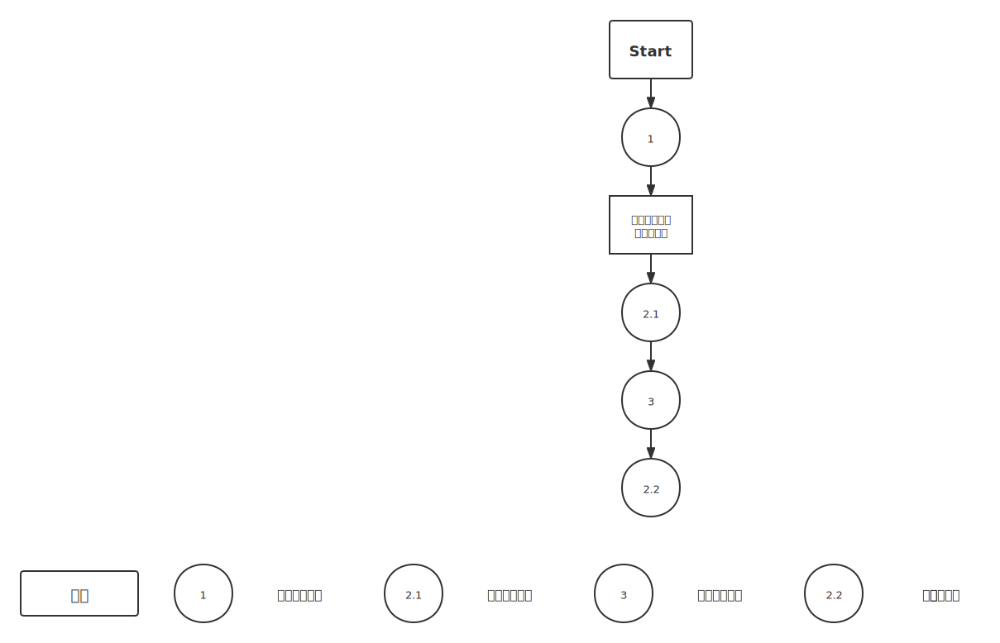

# Feature

1. 用户分级
   1. 管理员： 录入信息；包括：起始城市、目的城市、出发时间、到达时间、班次、交通方式（飞机||火车）以及费用。
   2. 普通用户：查询信息；有起始城市和目的城市，并选择何种最优决策（最快到达||最省钱到达）。
   3. ==**（可变需求）**==密码的加密算法，用户的寻址算法（数据库）
   3. ==**（必要需求）**==鉴权功能

# Requirements

1. **登陆系统模块==（高需求度）==**
   1. 普通用户 vs. 管理员用户==（鉴权模块）==
   1. 用户名和密码的加密==（可选模块）==
2. **IO系统模块==（必要模块）==**
   1. **Input模块**
      1. **对于管理员**：
         1. **初始化**
            1. 现有（已保存的数据）初始化
            2. 键盘输入（若有GUI，可使用接口引入）
         2. **CURD**
            1. 键盘输入（若有GUI，可开发接口使用GUI写入）
      2. **对于普通用户**：
         1. **初始化**：
            1. 必须使用现有文件加载数据
         2. **Search**
            1. 输入（GUI是选择）有起始城市和目的城市，并选择何种最优决策
   2. **Output模块**
      1. **对于初始化成功/失败的反馈信息**
      2. **对于CURD的返回信息**
         1. **特别的**：
            1. 针对查询模块的输出：
               1. **输出结构体**：
                  1. **{[(途经城市名1, 到达该城市时间1, 交通方式1, 费用1, 出发时间1, 到达下一个城市时间1, 到达的下一个城市名1)...], ((最短时间, 费用) || (最少费用, 时间))}**
                  2. **其中**，
                     1. **{}**表示是一个不同结构体的集合
                     2. **[(), (), ...]**表示是一个由**()**结构体组成的数组
                     3. **(() || ())**表示这个结构体为不同优先级输出的不同最终结果
                  3. **意义**：依次于何时何地乘坐几点的飞机或火车于何时到达何地；最终所需的最快需要多长时间才能到达及旅费，或者最少需要多少旅费才能到达及时间。
   3. **最优决策功能模块==（核心模块）==**
      1. 核心算法：**Dijkstra算法**

# Flow Graph

